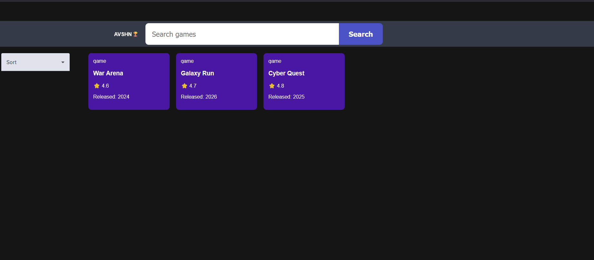
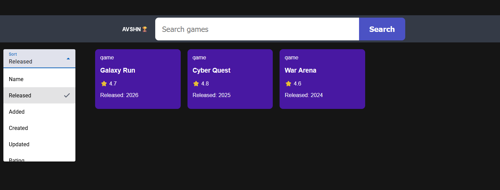
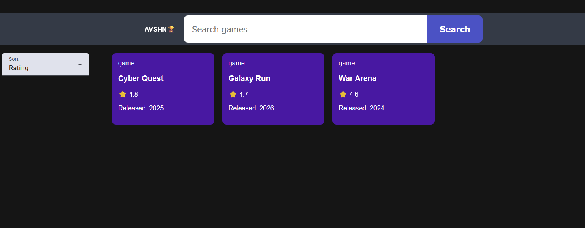

# Angular Game Explorer

A mini web application built with Angular 21 and TypeScript.

## Features

- Search bar UI
- Sort dropdown (Name, Rating, Released)
- Responsive game cards
- Angular Material components
- Dark modern UI

## Tech Stack

- Angular 21
- TypeScript
- Angular Material
- SCSS

## Screenshots Of Project

### Home Page

### Sort Dropdown

### Sorted by Rating

